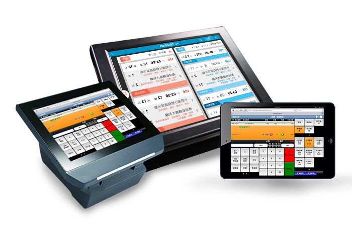

# 關於

 

**圖1-1  POS畫面示意圖**

 

研究市面上的POS系統後，我們發現各家POS的系統功能都十分令人眼花撩亂，有用的、沒有的功能全部塞在一個小小的畫面中，華麗但，實用嗎？
因著這樣的出發點，我們研發出POS King系統，拿掉令人眼花撩亂的功能，留下最原始、也最重要的功能。我們致力於：
 

功能完整：保留所有營業上需求之功能。
 
雲端連動：營業動態即時聯結雲端
 
簡單輕巧：去蕪存菁，化繁為簡的操作。
 
價格貼心：無論店面大小皆可輕鬆使用的POS系統。
 

**表1-1  市面上現有版本之優劣勢評比**

 

<table width="100%" >
  <tr>
    <td ></td>
    <td width="47%">市面上現有版本</td>
    <td width="100%">POS KING版本</td>

  </tr>
  <tr>
    <td rowspan="4" width="11%">前台</td>
    <td >系統完整</td>
    <td>系統完整</td>
  </tr>

  <tr>
    <td>整體美觀，但不易操作</td>
    <td>整體美觀，老少咸宜</td>
  </tr>
  <tr>
    <td>功能鬆散</td>
    <td>功能整合</td>
  </tr>
  <tr>
    <td>無</td>
    <td>整合雲端，資料可帶著走</td>
  </tr>

  <tr>
    <td rowspan="4" width="13%">後台</td>
    <td >表單功能完整</td>
    <td >表單功能完整</td>
  </tr>
  <tr>
    <td>整體乾淨，但不易尋找資料</td>
    <td>整體美觀，分類明確</td>
  </tr>
  <tr>
    <td>表單類別鬆散</td>
    <td>表單類別整合</td>
  </tr>
  <tr>
    <td>無</td>
    <td>整合雲端，資料報表可攜</td>
  </tr>
</table>

