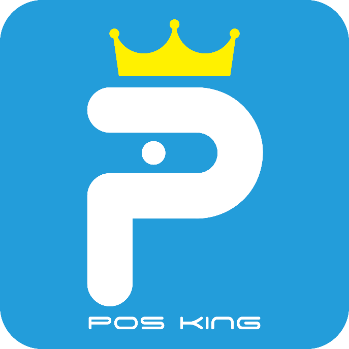

#品牌識別

 

**字體：Space Age**
 
**RGB：3,169,244**
 

青藍色，除了是企業的代表色之外，也有著整潔及現代的意義，因此我們選擇它作為Logo的主色，藉此帶出我們的軟體特色。而為了讓Logo顯得簡單俐落，我們選擇使用無襯線字，並將國王的意象帶入設計，其中主要的「P」，除了看起來像國王的側面，也代表我們的POS系統，同時蘊含了我們對它深深的期許——希望它能成為POS系統中的王。

