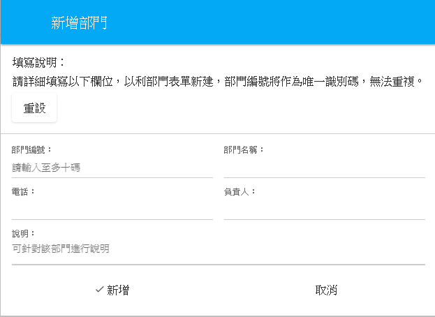
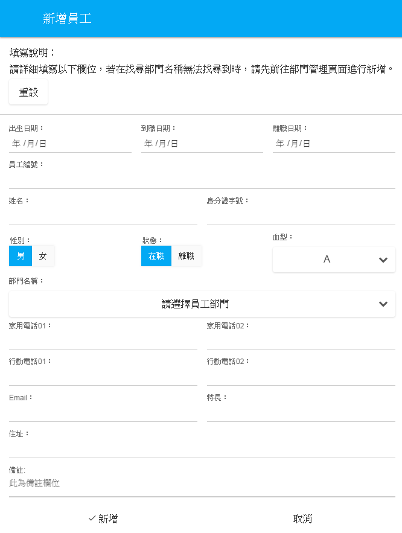
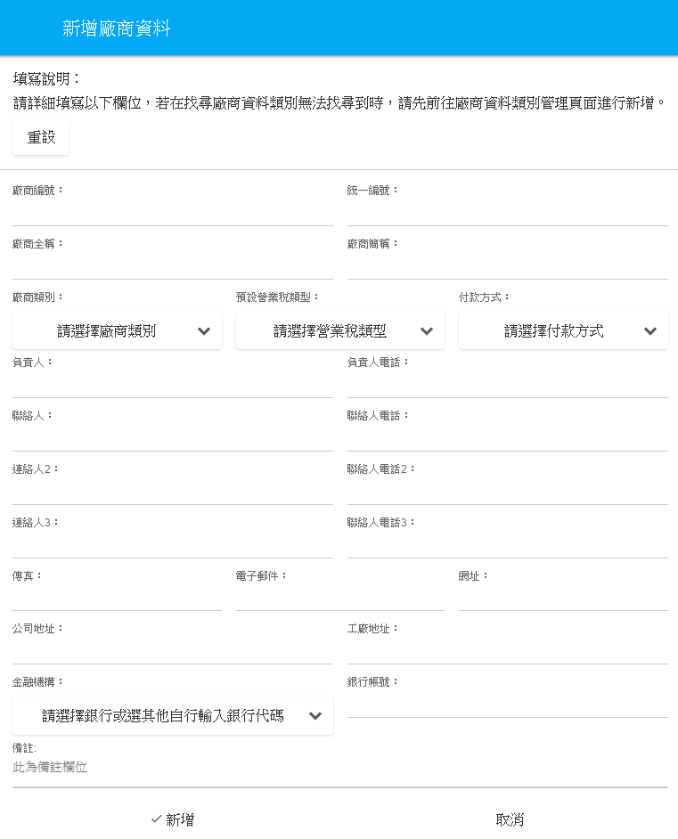
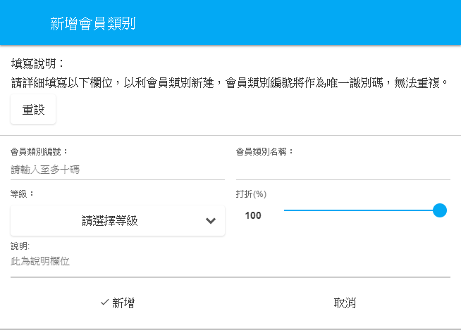
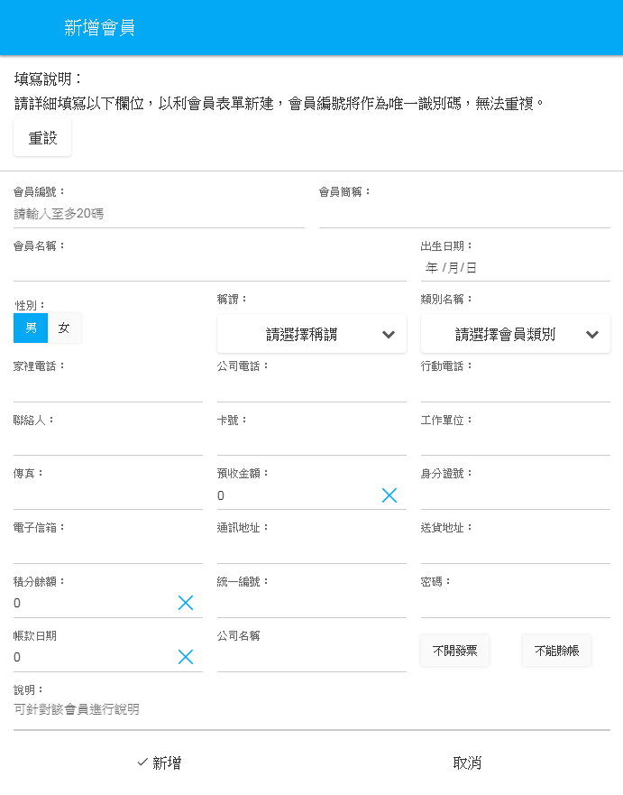

#基本功能
營運用資料設定，皆在此分類項完成，又可細分為：
 

1.部門資料管理：
 
部門相關資料建構，列表式呈現，可於短時間內流覽該部門相關資料，新增部門資料採彈跳式視窗列表，可一次完成設定。

 

 
**圖4-1  新增部門功能圖**

 

2.員工資料管理：
 
員工資料編輯建構，包含員工基本資料及在職狀況，可供查詢及編輯。

 
 

 
**圖4-2  新增員工功能圖**

 

3.廠商資料管理：
 
廠商詳細資料建構，包含稅金、付款方式、金融機構等等詳細且彈性類別資料，類別編輯可至數據字典自行新增
。
 
 

 
**圖4-3  新增廠商功能圖**

 

4.會員類別管理：
 
會員類別設定，在此可設定不同級別之會員，包含會員消費折扣數都可自行新增及修改。
 
 

 
**圖4-4  新增會員類別功能圖**

 

5.會員管理：
 
與其他軟體編輯會員相關資料不同，可直接匯入檔案(支援CSV檔案)使用，編輯完成後，也提供匯出檔案(EXCEL及ODS檔案)功能。

 
 

 
**圖4-5  新增會員功能圖**

