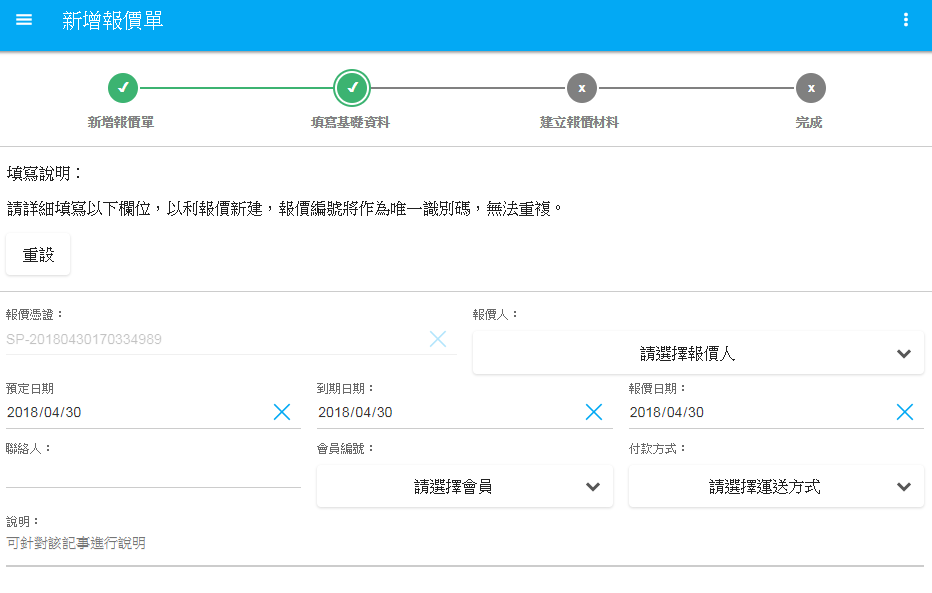
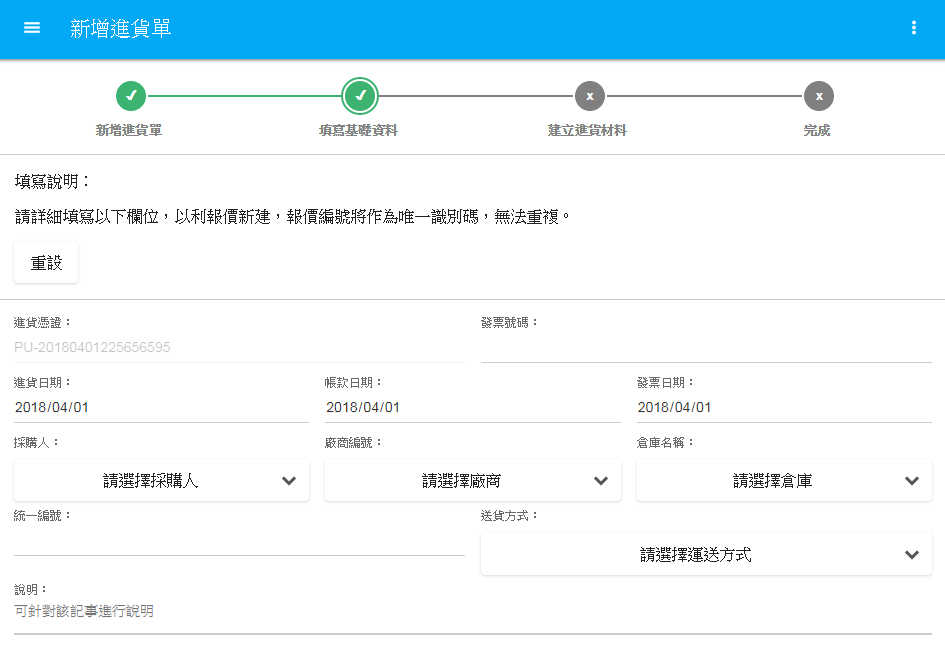
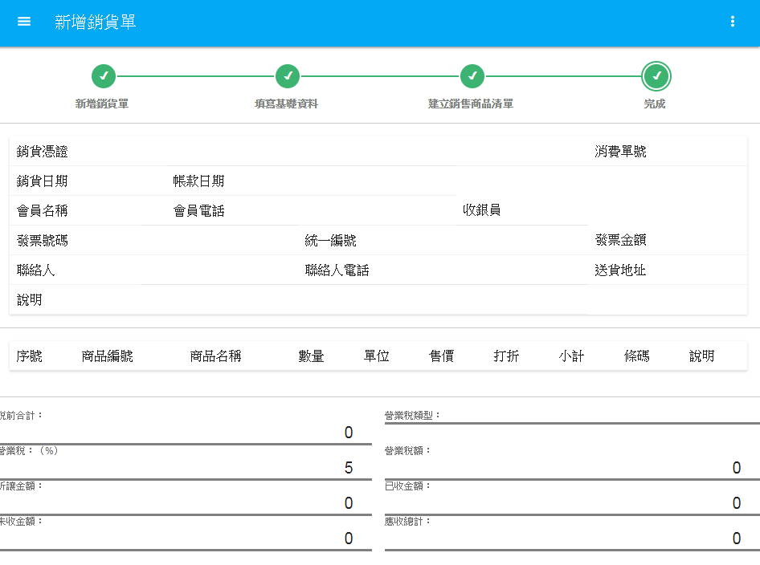
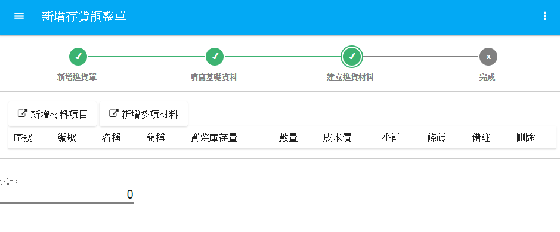
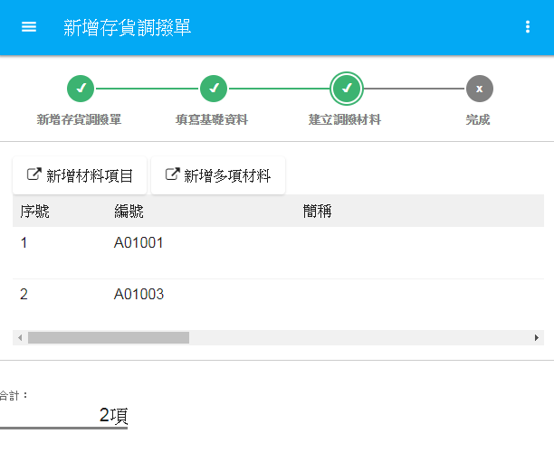

# 進銷存管理
1.報價管理：
 
具有即時查詢功能，所有表單可以迅速查詢。
 
在新增報價單的部分，報價編號為唯一憑證，無法重複。填寫過基本報價人員資料後，即可編輯報價單內容，可一次選取多種品項，再針對各種品項進行數量及價格等編輯，輸入完畢進入檢閱畫面，確認無誤後，即可存檔入庫。

 

 
**圖4-7  新增報價單功能圖**

 
2.進貨管理：
 
此功能提供進貨品項須輸入的詳細資料，可供使用者登錄及查閱。 
新增進貨單中，填寫基本進貨資料後，即可針對品項進行編輯。除一次可選取多項商品外，還提供檢閱歷史訂購紀錄及回填成本功能；使用者可依據上次訂購的商品及數量，來決定此次訂購數量、回填成本用於此次進價與往常進價有出入時，可直接將新的價格登錄資料庫中。在編輯完營業稅及折讓金額等資料後，可即時顯示應付金額，進行檢閱確定資料無誤後，即可存檔入庫。
 
 

 
**圖4-8  新增進貨單功能圖**

 
3.銷貨管理：
 
條列式顯示歷史銷貨單紀錄，在新增銷貨單中，銷貨單編碼為唯一識別，無法重複。將詳細進貨資料填寫後，可進入下一部，登錄銷貨商品細項設定。除可一次多選商品外，還有歷史紀錄可供查詢，勾選好數量及商品後，下方會即時顯現稅額及應收未收等款項，確認無誤後即可存檔入庫。
 
 

 
**圖4-9  新增銷貨單功能圖**

 
4.存貨調整管理：
 
當存貨出現異動時，可至存貨調整管理進行修改。新增存貨調整單中，調整編碼為唯一識別，無法重複。填寫完基本資料後，及可針對各項或多項商品進行調整。
 
 

 
**圖4-10  新增存貨調整單功能圖**

 
5.存貨調撥管理：
 
存貨調撥用於分店及分店之間物品支援調撥用，調撥單憑證碼為唯一識別碼，無法重複。
 
歷史調撥紀錄採列表方式呈現，若需新增調撥單，先填寫完基本資料後，及可針對單項或多項物品登錄，下方會即時呈現品項數量，確認無誤後即可存檔入庫。
 
 

 
**圖4-11  新增存貨調撥單功能圖**

