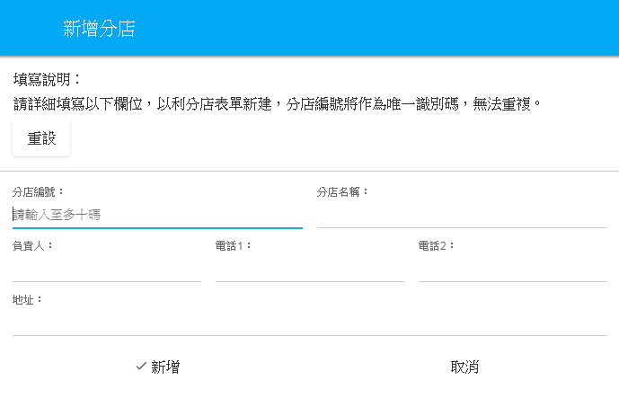
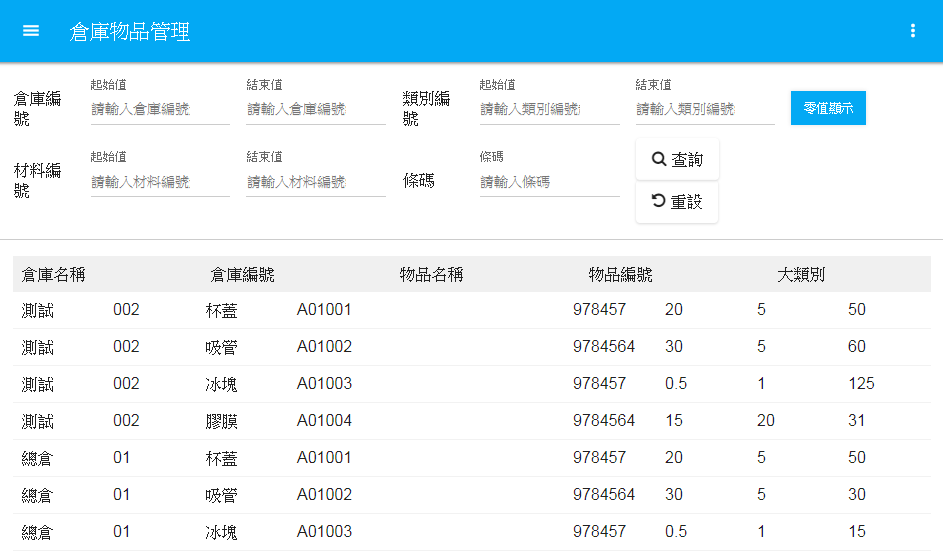
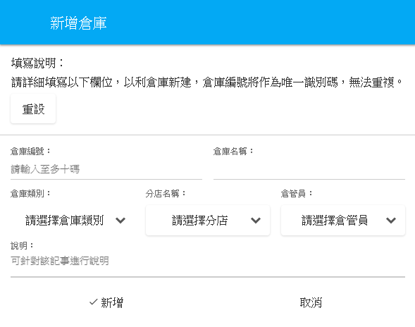

# 倉儲管理
1.分店資料管理：
 
若有新的分店須加入，可從分店資料管理內新增。各家分店採條列式顯示，有利於查詢及編輯。

 

 
**圖4-12  新增分店功能圖**

 
2.倉庫物件管理：
 
所有倉庫內存有物件皆可在此作查詢，包含目前庫存數量、進價及售價，採用列表顯示、多種查詢方式，讓使用者更快速尋找到所需資訊。
 
 

 
**圖4-13  倉庫物品管理功能圖**

 
3.倉庫管理：
 
若有新的倉庫需新增，都可在倉庫管理新增完成。倉庫編碼作為唯一識別碼，無法重複。將表單內資訊填寫完成及可新增倉庫，倉庫類別、分店名稱、倉管員等選項，皆可自訂。

 
 

 
**圖4-14  倉庫管理功能圖**

