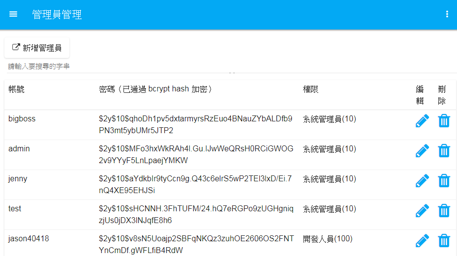
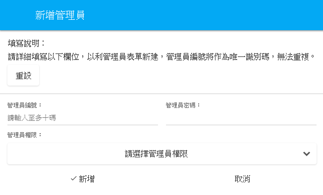
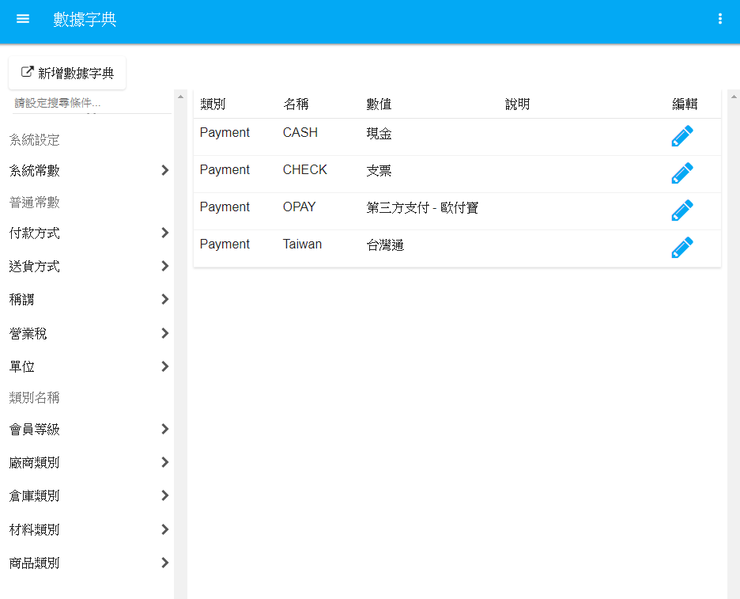

# 系統管理
1.管理員管理：
 
所有員工權限新增及管理，可針對不同職位員工設定不同權限使用系統。所有員工設定之密碼採用bcrypt hash加密，確保資料安全性。

 

 
**圖4-15  管理員管理功能圖**
 
 

 
**圖4-16  新增管理員功能圖**

 
2.數據字典：
 
系統內所有選項新增及管理，可分別對於不同功能選項作編輯：
 
* 系統常數：可設定輸入格內為數字或是文字。
* 付款方式：可設定付款方式如：現金、支票、支付寶等。
* 送貨方式：可設定出/收貨方式如：親取、黑貓、大榮等。
* 稱謂：可設定稱謂如：先生、小姐、同學等。
* 營業稅：可設定不同內含或外加稅額如：內含稅、零稅等。
* 單位：可設定不同的單位名稱如：個、瓶、顆等。
* 會員等級：可設定不同會員的級別，已利於給予不同折扣。
* 廠商類別：可設定不同廠商類別及常用數值。
* 倉庫類別：可設定不同倉庫類別如：成品倉、原料倉等。
* 材料類別：可設定所有成品材料編號及名稱。
* 商品類別：可設定所有產品材料編號及名稱。

 
**圖4-17  數據字典功能圖**

