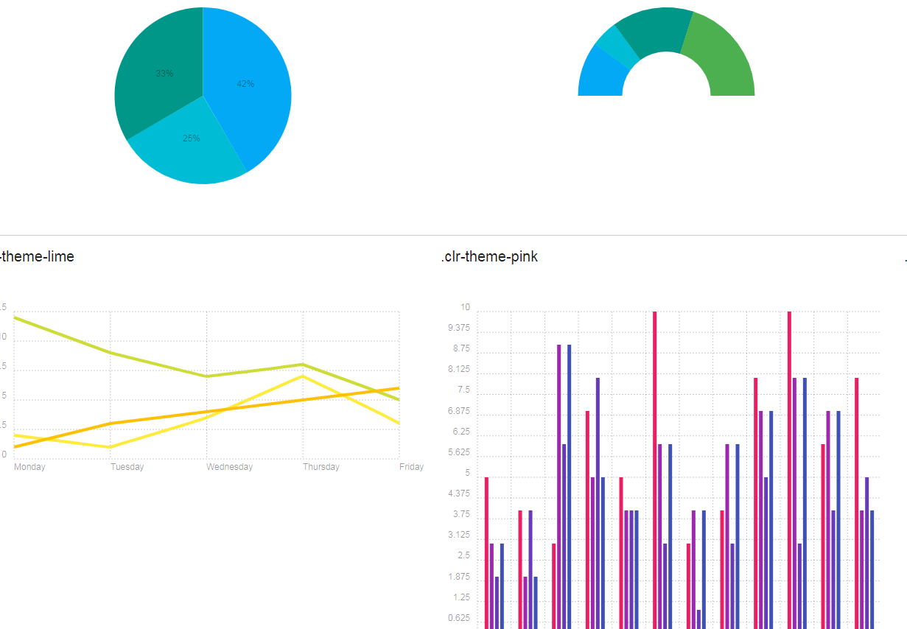
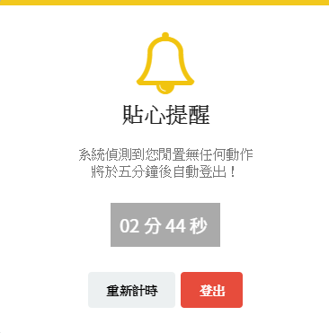
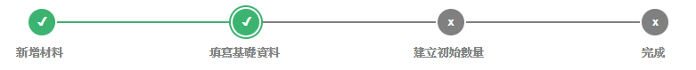

#特殊功能
1.歷代版本更新資訊
 
於登入處下方，顯示目前版本功能，往後若有更新，也會紀載於此處，供使用者查閱。

 

 
**圖4-19  更新資訊圖**

 
2.動態圖表
 
登入後，可見各式不同動態圖表，圖表數據會依據資料庫內現有資料作動態顯示，也支援圖表匯出功能，提供使用者不同的選擇。

 

 
**圖4-20  動態表單示意圖**

 
3.即時登出
 
使用者若閒置過久，因保護資料緣故，會自動倒數登出。

 

 
**圖4-21  即時登出圖**

 
4.即時儲存
 
編輯表單時，系統會自動讀取歷史資料，若有發現未完成的表單，會提示使用者是否繼續編輯。

 

 
**圖4-22  即時儲存功能圖**

 
5.動態提醒
 
在編輯表單的過程中，會出現貼心的動態小提醒，幫助使用者編輯順暢。

 

 

 

 
**圖4-23  動態提醒功能圖**

